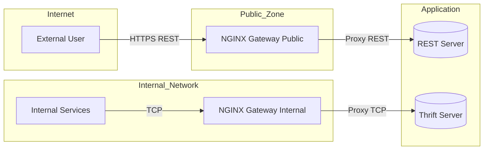

```mermaid
graph LR
  subgraph Internet
    UE[External User]
  end

  subgraph Public_Zone
    N1[NGINX Gateway Public]
  end

  subgraph Internal_Network
    SVC[Internal Services]
    N2[NGINX Gateway Internal]
  end

  subgraph Application
    RS[(REST Server)]
    TS[(Thrift Server)]
  end

  UE -->|HTTPS REST| N1
  N1 -->|Proxy REST| RS
  SVC -->|TCP| N2
  N2 -->|Proxy TCP| TS
```
