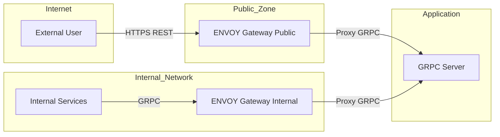

```mermaid
graph LR
  subgraph Internet
    UE[External User]
  end

  subgraph Public_Zone
    N1[ENVOY Gateway Public]
  end

  subgraph Internal_Network
    SVC[Internal Services]
    N2[ENVOY Gateway Internal]
  end

  subgraph Application
    GS[GRPC Server]
  end

  UE -->|HTTPS REST| N1
  N1 -->|Proxy GRPC| GS
  SVC -->|GRPC| N2
  N2 -->|Proxy GRPC| GS
```